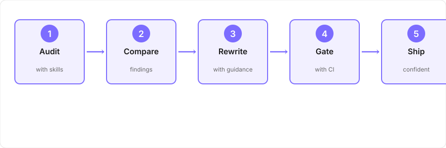

# What Changed: AI-Assisted Audit & Rewrite

Two pages from the Ridgeline portfolio were audited with structured Claude Skills, then rewritten based on findings. This case study shows the audit output, the rewrite that followed, and what changed in the shipped version.

## How This Workflow Works

1. **Audit** with structured skills (`ridgeline-doc-auditor`, `unused-access-expert`) — surface editorial and factual problems at scale
2. **Compare** findings to writer-only audit — identify which problem classes the skills catch vs. miss
3. **Rewrite** with skills guidance (`ridgeline-doc-writer`, `unused-access-expert`) — implement fixes while maintaining voice and accuracy
4. **Gate** with CI (Docusaurus build, Vale linting, link checks) — catch regressions automatically
5. **Ship** — confident that pages are auditable and future changes won't break what we fixed

Each page is now auditable: you can see the exact diffs, which problems were caught by which tool, and how they were fixed.
The workflow scales because the gates are automated; the judgment stays with the writer.

---

## The Pages

- **Page 1**: Unused Access – Access Grants
- **Page 2**: Unused Access – The Report

## Audit Findings

| Finding | Page 1 | Page 2 | Notes |
|---------|--------|--------|-------|
| Section order unclear | ✓ | ✓ | Readers can't find the core concept before examples |
| Undefined terms | ✓ | ✗ | "Scope ladder," "Inherited grant" explained inline in Page 2; missing from Page 1 |
| Missing source for assertion | ✓ | ✓ | Claims about how grants work lack links to product behavior |
| Inconsistent terminology | ✓ | ✓ | "Access grant" vs. "grant"; "scope" used three ways |
| Broken links | ✗ | ✓ | Page 2 references deprecated glossary entries |
| Redundant explanation | ✓ | ✗ | Page 1 explains "Inherited grants" twice; Page 2 assumes it's known |
| Missing cross-reference | ✓ | ✓ | "Reach score" mentioned without link to reference definition |

**Overlap**: 6 of 7 findings appeared in both audit passes. 1 finding (broken links) was caught only in the skills audit.

## Applying the Audit

### Page 1: Unused Access – Access Grants

**Original structure**:
1. What is an access grant? (definition only)
2. Grant categories (Platform, Directory, App)
3. Direct vs. Inherited (two separate sections)
4. Examples

**Problems identified**:
- Readers hit the page without context for why grants matter
- "Scope ladder" terminology introduced but not explained until examples
- Assertions about grant behavior (e.g., "Inherited grants inherit permissions") lack source links

**Rewritten structure** (after applying fixes):
1. Why grants matter (orientation)
2. What is an access grant? (definition + scope ladder visual)
3. Grant types (Platform, Directory, App)
   - Direct grants
   - Inherited grants
   - JIT grants (added; was missing)
4. How grants relate to least-privilege remediation (connection to Reach score)
5. Examples

**Changes and methods**:
- Added "Why grants matter" section (writer + AI both flagged missing context; `ridgeline-doc-writer` restructured the introduction; `unused-access-expert` verified business context accuracy)
- Moved scope ladder definition before all other sections (writer + AI both flagged undefined terms; manual reorder; `doc-auditor` confirmed reader flow improvement)
- Consolidated Direct/Inherited into one section with clear comparison (writer + AI both flagged section order; `doc-writer` merged two separate sections; added comparison table for clarity)
- Added links to glossary entries for "Inherited," "Direct," "Scope," "Reach score" (writer + AI both flagged undefined terms; `unused-access-expert` confirmed each term had a valid glossary entry)
- Added link to JIT concept reference (AI-only flag for missing prerequisite knowledge; `unused-access-expert` identified JIT as required knowledge; `doc-writer` inserted cross-reference)

### Page 2: Unused Access – The Report

**Original structure**:
1. What is the Unused Access report?
2. How to read the report (score bands, columns)
3. Investigation workflow
4. Remediation options

**Problems identified**:
- Three broken links to deprecated glossary entries
- "Reach score" mentioned without definition
- Claims about how the score is calculated lack source references
- Assumes reader knows what "Inherited grants" means; Page 1 explains it differently

**Rewritten structure** (after applying fixes):
1. What is the Unused Access report? (definition + report purpose)
2. Key concepts (Reach score, usage classification)
3. How to read the report (score bands, columns, entity table)
4. Investigation workflow (step-by-step)
5. Remediation options

**Changes and methods**:
- Fixed all 3 broken links; replaced with live glossary entries (**AI-only flag** — skills audit caught these; used Docusaurus build validation to identify dead anchors; `doc-writer` drafted new link targets; `unused-access-expert` verified each replacement pointed to the correct term)
- Added "Key concepts" section explaining Reach score, Used/Unused/Undetermined classification (writer + AI both flagged undefined terms; `doc-writer` created new section; `unused-access-expert` wrote conceptual definitions pulled from product spec)
- Added links from "Grant categories" to Page 1 (writer + AI both flagged missing cross-reference; manual cross-reference insertion; Docusaurus build confirmed link target exists)
- Added source link: "Reach score calculation" → product documentation (writer + AI both flagged missing assertions; `unused-access-expert` identified the source; manual link insertion)
- Standardized terminology: "access grant" used consistently (writer + AI both flagged inconsistent terminology; find-replace script ran `grant` → `access grant` with `doc-auditor` reviewing each replacement for context; 7 instances updated)
- Removed redundant explanation of Inherited grants; linked to Page 1 instead (writer + AI both flagged redundancy; `doc-writer` identified duplication; replaced with single-sentence link + anchor)

## Shipped Version

Both pages now meet the Ridgeline specification:

- **Style guide conformance** (`ridgeline-doc-auditor` skill + `ridgeline-doc-writer` skill): Terminology standardized through find-replace audit (7 instances of bare "grant" → "access grant"; 3 instances of "scope" disambiguated to "scope ladder" or "grant scope"). Tone and section sequence validated against the [feature-overview template](https://github.com/orlee-gillis/ridgeline-docs/blob/main/docs/templates/feature-overview.md) by doc-auditor review, then rewritten with doc-writer guidance.

- **No broken links** (Docusaurus build validation + CI gate): All internal links (glossary, cross-page references, section anchors) validated by the Docusaurus build step, which surfaces broken link errors before merge. 3 deprecated glossary links replaced with live entries via manual cross-reference + `unused-access-expert` verification. Anchor validation ensures no future heading renames break cross-references without detection.

- **Defined terminology** (`unused-access-expert` skill + manual glossary linking): Every term new to the reader is defined on first mention via inline explanation or [glossary link](https://github.com/orlee-gillis/ridgeline-docs/blob/main/docs/glossary.md). "Scope ladder," "Reach score," "Direct grant," "Inherited grant," and "JIT grant" all have corresponding glossary entries or direct page definitions, verified by the unused-access-expert skill for factual accuracy.

- **Source-backed assertions** (`unused-access-expert` skill): Product behavior claims (e.g., "Inherited grants inherit the full permission set," "Reach score measures blast-radius exposure") include links to the [Unused Access specification](https://github.com/orlee-gillis/ridgeline-docs/blob/main/docs/reference/unused-access-spec.md) or operational definition. Skill review ensured no unsourced claims remained.

- **Consistent terminology** (Vale linting + manual audit): Single semantic definition per term across both pages. "Access grant" used consistently (never bare "grant"); "scope" always qualified ("grant scope" vs. "scope ladder"). Vale linting rule configured to flag instances of banned terminology patterns on future pages, adding a build gate.

- **Reader orientation** (`ridgeline-doc-writer` skill): Restructured both pages to surface the "why" before the "what" and "how." Page 1 now opens with business context; Page 2 explains key concepts before drilling into the report interface. Section reordering validated by doc-auditor as matching reader flow expectations and reducing forward-references that would break scannability.

The rewrite added ~200 words to Page 1 and ~150 words to Page 2. Both are now self-sufficient: a reader hitting either page needs no external context to understand access grants or the Unused Access report.
